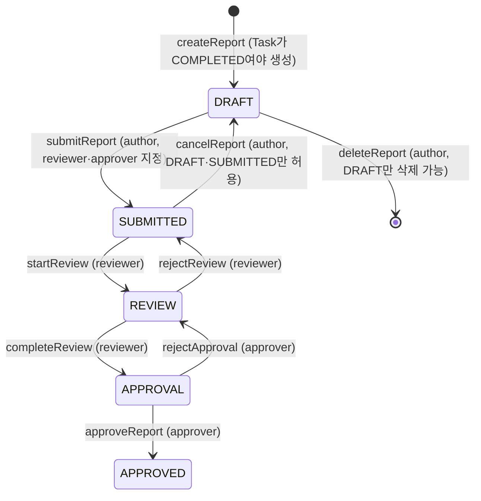
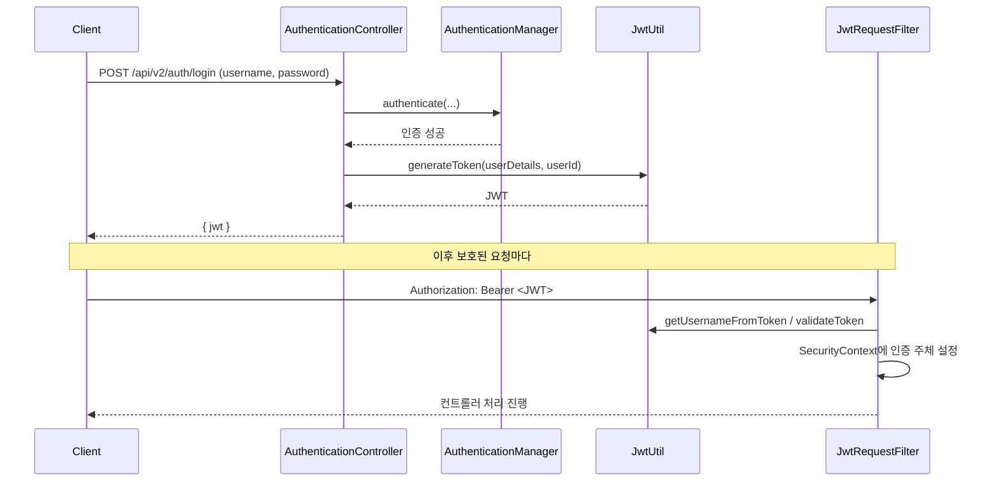

# 아키텍처 문서 (ARCHITECTURE)

Minilog 애플리케이션의 구조와 구성 요소를 설명하는 문서입니다.

## 1. 개요

**Minilog**는 Spring Boot 3.5.10 / Java 21 기반의 REST API 애플리케이션입니다. 다음 두 가지 성격의 도메인을 하나의 애플리케이션에서 다룹니다.

- **소셜/업무 도메인** — 사용자, 게시글, 팔로우, 작업(Task)·장비(Device), 작업 보고서(TaskReport) 워크플로우
- **외부 데이터 수집 배치** — 공개 API(USGS 지진, CoinGecko 시세)를 주기적으로 수집·적재

특징적으로 **4개의 독립 MySQL 데이터베이스**(데이터소스)를 사용하며, 계층형(Layered) 아키텍처와 JWT 기반 인증을 따릅니다.

## 2. 기술 스택

| 분류 | 사용 기술 |
|---|---|
| 언어/런타임 | Java 21 |
| 프레임워크 | Spring Boot 3.5.10 (Web MVC, Data JPA, Security, Batch) |
| 영속성 | Spring Data JPA / Hibernate, MySQL 8 (`mysql-connector-java:8.0.32`) |
| 인증 | Spring Security + JWT (`io.jsonwebtoken:jjwt 0.11.5`) |
| 배치 | Spring Batch (`spring-boot-starter-batch`) + `@Scheduled` |
| API 문서 | springdoc-openapi (Swagger UI) `2.8.14` |
| 검증 | Bean Validation (`spring-boot-starter-validation`) |
| 코드 생성 | Lombok |
| 빌드/포맷 | Gradle, Spotless (google-java-format 1.22.0, `build` 시 `spotlessApply` 자동 실행) |
| 테스트 | JUnit 5, Mockito, Spring Security Test, Testcontainers(MySQL) |

진입점은 `com.asdf.minilog.MinilogApplication`(`@SpringBootApplication`), 루트 프로젝트명은 `minilog-all`입니다.

## 3. 전체 아키텍처

요청 처리 계층(Controller → Service → Repository)과 배치 계층이 데이터소스별로 분리되어 동작합니다.

```mermaid
flowchart LR
    subgraph API[REST API 계층]
      AUTH[AuthenticationController]
      CTRL[도메인 Controllers]
    end
    subgraph SVC[서비스 계층]
      S[Services + EntityDtoMapper]
    end
    subgraph BATCH[배치 / 스케줄링]
      QB[QuakeBatch<br/>Spring Batch · 10분]
      CB[CryptoPriceScheduler<br/>@Scheduled · 3분]
    end

    CTRL --> S
    AUTH --> S
    S --> RM[(main_db<br/>minilog_all_db)]
    S --> RT[(task_db)]
    QB --> RQ[(quake_db)]
    CB --> RC[(crypto_db)]
    QB -. BATCH_* 메타테이블 .-> RM

    USGS([USGS Earthquake API]) --> QB
    COIN([CoinGecko API]) --> CB
```

- **요청 흐름**: 클라이언트 → `@RestController`(`/api/v2/**`) → `@Service`(트랜잭션 경계) → `JpaRepository` → DB. 엔티티↔DTO 변환은 `util/EntityDtoMapper`(정적 메서드)가 담당.
- **배치 흐름**: 스케줄러가 외부 API를 호출해 전용 DB에 적재. 자세한 내용은 [§9](#9-배치--스케줄링).

## 4. 패키지 구조

```
com.asdf.minilog
├── MinilogApplication          # 진입점 (@SpringBootApplication)
├── config/                     # 설정 (데이터소스 4종, 보안, 스케줄링, RestClient, Swagger, JPA Auditing)
├── controller/                 # REST 컨트롤러 (/api/v2/**)
├── service/                    # 비즈니스 로직 + 트랜잭션 경계
├── repository/
│   ├── main/                   # main_db 리포지토리
│   └── task/                   # task_db 리포지토리
├── entity/
│   ├── main/                   # User, Article, Follow, TaskReport, Role, ReportStatus
│   ├── task/                   # Device, Task, TaskStatus
│   ├── quake/                  # Earthquake
│   └── crypto/                 # CryptoPrice
├── batch/
│   ├── quake/                  # Spring Batch (Config·Scheduler·Client·DTO)
│   └── crypto/                 # @Scheduled 스케줄러
├── dto/                        # 요청/응답/요약 DTO
├── security/                   # JWT 필터, UserDetails, 권한
├── util/                       # JwtUtil, EntityDtoMapper
└── exception/                  # 커스텀 예외 + GlobalExceptionHandler
```

> 참고: `repository.quake`/`repository.crypto`, `batch.quake.dto`도 존재합니다(배치 관련).

## 5. 데이터소스 / 영속성

4개의 데이터소스를 각각 별도 `@Configuration`으로 정의합니다. **`main`만 `@Primary`** 이며, 각 데이터소스는 전용 `EntityManagerFactory`·`TransactionManager`로 지정된 패키지만 스캔합니다.

| 데이터소스 | DB | 엔티티 패키지 | 리포지토리 패키지 | 트랜잭션 매니저 | 설정 클래스 |
|---|---|---|---|---|---|
| main (`@Primary`) | `minilog_all_db` | `entity.main` | `repository.main` | `transactionManager` | `MainDataSourceConfig` |
| task | `task_db` | `entity.task` | `repository.task` | `taskTransactionManager` | `TaskDataSourceConfig` |
| quake | `quake_db` | `entity.quake` | `repository.quake` | `quakeTransactionManager` | `QuakeDataSourceConfig` |
| crypto | `crypto_db` | `entity.crypto` | `repository.crypto` | `cryptoTransactionManager` | `CryptoDataSourceConfig` |

**트랜잭션 라우팅 규칙**
- 기본(`@Transactional`)은 `main` 트랜잭션 매니저를 사용 → `ArticleService`, `TaskReportService`, `UserService`, `FollowService`.
- 비-main DB에 쓰는 컴포넌트는 트랜잭션 매니저를 **명시**해야 함:
  - `DeviceService`/`TaskService` → `@Transactional("taskTransactionManager")`
  - `CryptoPriceScheduler` → `@Transactional("cryptoTransactionManager")`
  - 지진 배치 Step → 청크 트랜잭션 매니저로 `quakeTransactionManager` 지정
- **Spring Batch 메타테이블(`BATCH_*`)은 `@Primary`인 `main_db`에 생성**됩니다(`spring.batch.jdbc.initialize-schema=always`).
- JPA Auditing(`JpaAuditingConfig`, `@EnableJpaAuditing`)으로 모든 엔티티의 `createdAt`/`updatedAt`이 자동 관리됩니다.

> 데이터소스 간에는 DB 레벨 외래키가 없습니다. 예: `TaskReport`는 `task_db`의 `Task`를 `taskId`(값)로만 참조하며, 분산 트랜잭션 대신 **서비스 계층에서 존재·상태를 검증**합니다.

## 6. 도메인 모델

### 6.1 엔티티 관계

| 엔티티 | DB | 주요 필드 | 연관관계 |
|---|---|---|---|
| `User` | main | `userName`(unique), `password`(BCrypt), `roles`(`Set<Role>`, `@ElementCollection`→`user_roles`) | `@OneToMany` articles |
| `Article` | main | `content` | `@ManyToOne` author(User) |
| `Follow` | main | (follower, followee) 유니크 제약 | `@ManyToOne` follower/followee(User) — 자기참조 |
| `TaskReport` | main | `taskId`(unique), `content`, `status`(ReportStatus) | `@ManyToOne` author / reviewer(nullable) / approver(nullable) |
| `Attachment` | main | `originalFileName`, `storedFileName`, `contentType`, `fileSize`, `data`(LONGBLOB) | 없음(파일 메타데이터 + 바이트) |
| `Device` | task | `name`, `type` | `@OneToMany` tasks |
| `Task` | task | `name`, `description`, `status`(TaskStatus) | `@ManyToOne` device |
| `Earthquake` | quake | `magnitude`, `place`, `eventTime`, 좌표 | USGS event id를 **자연키(PK)** 로 사용 → 업서트 |
| `CryptoPrice` | crypto | `coin`, `priceUsd`, `priceKrw`, `fetchedAt` | 없음(시계열 누적) |

열거형:
- `Role`: `ROLE_ADMIN`, `ROLE_AUTHOR`, `ROLE_REVIEWER`, `ROLE_APPROVER`
- `TaskStatus`: `STARTED` → `IN_PROGRESS` → `COMPLETED`
- `ReportStatus`: `DRAFT` → `SUBMITTED` → `REVIEW` → `APPROVAL` → `APPROVED`

### 6.2 TaskReport 워크플로우 (상태 머신)

작업 보고서는 작성자(author)·검토자(reviewer)·승인자(approver)가 단계적으로 처리하는 결재 흐름을 가집니다. 모든 전이는 `TaskReportService`에서 현재 상태와 수행 주체를 검증합니다.



- 생성 전제: 대상 `Task`가 `COMPLETED` 상태여야 하며, 보고서는 task당 1건(유니크).
- `updateReport`는 `DRAFT`/`SUBMITTED` 상태에서 내용만 수정.
- 권한 검증 헬퍼: `requireAuthor`, `requireReviewer`, `requireApprover`, `requireStatus`/`requireStatusIn` (서비스 내부).

## 7. 계층 구조

| 계층 | 책임 | 비고 |
|---|---|---|
| Controller | HTTP 요청/응답, 입력 검증(`@Valid`), 페이징, 인증 주체 추출(`@AuthenticationPrincipal MinilogUserDetails`) | `@RestController`, `/api/v2/**` |
| Service | 비즈니스 로직, 트랜잭션 경계, 권한 검증, 도메인 상태 전이 | `@Transactional`(매니저 명시 규칙은 [§5](#5-데이터소스--영속성)) |
| Repository | 데이터 접근(`JpaRepository`), 커스텀 쿼리/`JOIN FETCH`로 N+1 방지 | 데이터소스별 패키지 분리 |
| DTO / Mapper | API 계약과 도메인 분리, `EntityDtoMapper` 정적 변환 | Request/Response/Summary DTO |

페이징 엔드포인트는 `@ParameterObject @PageableDefault(...)`로 Swagger에 `page/size/sort`가 분해 표시되며 `Page<T>`를 반환합니다. N+1 방지 예: `DeviceService.getDevicesWithTasks`가 디바이스 목록 조회 후 `taskRepository.findAllByDeviceIdIn(...)`으로 일괄 적재해 그룹핑.

## 8. REST API & 보안

### 8.1 컨트롤러 목록

| 컨트롤러 | 베이스 경로 | 책임 |
|---|---|---|
| `AuthenticationController` | `/api/v2/auth` | 로그인(JWT 발급) |
| `UserController` | `/api/v2/user` | 사용자 CRUD |
| `ArticleController` | `/api/v2/article` | 게시글 CRUD |
| `FollowController` | `/api/v2/follow` | 팔로우/언팔로우, 팔로우 목록 |
| `FeedController` | `/api/v2/feed` | 팔로우 기반 피드 |
| `DeviceController` | `/api/v2/devices` | 장비 CRUD + 페이징 |
| `TaskController` | `/api/v2/tasks` | 작업 CRUD + 페이징 |
| `TaskReportController` | `/api/v2/reports` | 보고서 CRUD + 워크플로우 전이 |
| `ReviewerController` | `/api/v2/reviewers` | 검토자(ROLE_REVIEWER) 관리 |
| `ApproverController` | `/api/v2/approvers` | 승인자(ROLE_APPROVER) 관리 |
| `UploadFileController` | `/api/v2/files` | 파일 업로드(DB `attachments` + 서버 폴더 이중 저장) |
| `DownloadFileController` | `/api/v2/files/download` | 파일 다운로드(DB 저장본 `/db/{id}`, 폴더 저장본 `/disk/{id}`) |

### 8.2 인증/인가 (Spring Security + JWT)

`SecurityConfig`의 `SecurityFilterChain`은 **STATELESS** 세션, CSRF 비활성화, `BCryptPasswordEncoder`를 사용하며, `JwtRequestFilter`를 `UsernamePasswordAuthenticationFilter` **앞에** 등록합니다. 인증 실패는 `JwtAuthenticationEntryPoint`가 `401 {"message":"Unauthorized"}`로 응답합니다.

접근 규칙:

| 경로 | 정책 |
|---|---|
| `POST /api/v2/auth/login`, `/swagger-ui/**`, `/v3/api-docs/**` | permitAll |
| `POST /api/v2/user` (회원가입), `GET /api/v2/user/{userId}` | permitAll |
| `/api/v2/devices/**`, `/api/v2/tasks/**` | permitAll |
| `/api/v2/files/**` (업로드·다운로드) | permitAll |
| `DELETE /api/v2/user/{userId}` | `ROLE_ADMIN` |
| 그 외 | authenticated |

JWT는 `JwtUtil`이 HS256으로 서명하며, subject=username, 커스텀 클레임 `userId`, 만료 5시간(`jwt.secret`은 Base64 시크릿). 인증 흐름:



권한은 `User.roles`(`Set<Role>`)를 `MinilogGrantedAuthority`로 매핑해 `MinilogUserDetails`에 담깁니다.

## 9. 배치 & 스케줄링

freepublicapis.com에서 선정한 공개 API 2종을 주기적으로 수집합니다. 스케줄링은 `SchedulingConfig`(`@EnableScheduling`)로 활성화되며, `app.scheduling.enabled=false`로 끌 수 있습니다(테스트에서 외부 호출 차단용).

| 배치 | 방식 | 주기 | 대상 DB | 핵심 동작 |
|---|---|---|---|---|
| 지진 수집 | **Spring Batch** (Job/Step, 청크 100) | 10분 (`quake.batch.interval-ms`) | quake_db | `QuakeBatchScheduler`가 `JobLauncher`로 실행. `[현재−15분, 현재]` 증분 윈도우로 USGS 조회 → Reader/Processor/Writer 청크 처리 → event id 자연키로 **업서트** |
| 시세 수집 | **@Scheduled** | 3분 (`crypto.batch.interval-ms`) | crypto_db | `CryptoPriceScheduler`가 CoinGecko `simple/price`(BTC·ETH / USD·KRW) 조회 → `crypto_prices`에 시계열 1건씩 적재 |

- 외부 호출은 `RestClientConfig`의 `RestClient` 빈 2종(USGS·CoinGecko, 타임아웃 설정)을 `@Qualifier`로 구분해 사용.
- `spring.batch.job.enabled=false`로 부팅 시 자동 실행을 막고, 스케줄러가 트리거합니다.

## 10. 예외 처리

`exception` 패키지에 도메인별 커스텀 예외(`UserNotFoundException`, `ArticleNotFoundException`, `DeviceNotFoundException`, `TaskNotFoundException`, `TaskReportNotFoundException`, `NotAuthorizedException`)가 있으며, `GlobalExceptionHandler`(`@RestControllerAdvice`)가 이를 적절한 HTTP 상태와 JSON 본문으로 변환합니다.

## 11. API 문서화

`ApiDocumentationConfig`가 OpenAPI(제목 "Minilog API", 버전 v2)를 구성하고, `bearerAuth`(HTTP Bearer, JWT) 보안 스킴을 등록합니다. Swagger UI(`/swagger-ui/**`)와 API 문서(`/v3/api-docs/**`)는 인증 없이 접근 가능합니다.

## 12. 테스트 전략

계층 특성에 맞춰 세 가지 방식을 사용합니다.

| 방식 | 적용 | 예시 |
|---|---|---|
| `@WebMvcTest` (웹 슬라이스, 서비스는 목) | 컨트롤러의 요청/응답·상태코드·검증·예외 매핑 | `ArticleControllerTest`, `DeviceControllerTest`, `TaskControllerTest`, `UserControllerTest`, `FeedControllerTest`, `TaskReportControllerTest`, `ReportActorControllerTest` |
| `@ExtendWith(MockitoExtension.class)` (순수 단위) | 서비스 로직을 리포지토리 목으로 검증 | `DeviceServiceTest`, `TaskServiceTest`, `TaskReportServiceTest` |
| `@SpringBootTest` + Testcontainers(MySQL) | 실제 DB로 전체 컨텍스트 통합 검증 | `ArticleServiceTest` |
| 순수 JUnit (스프링 없음) | 엔티티/변환 로직 | `UserTest`, `QuakeBatchConfigTest` |

`ArticleServiceTest`는 유일한 전체 컨텍스트 테스트로, `@DynamicPropertySource`로 **4개 데이터소스를 모두 하나의 테스트 컨테이너**에 매핑하고 `app.scheduling.enabled=false`로 스케줄러(외부 API 호출)를 비활성화합니다.

## 13. 빌드 & 실행

### 사전 준비 — 데이터베이스
애플리케이션은 4개 DB를 사용합니다. `minilog_all_db`는 컨테이너 초기화로 생성되지만, 나머지는 **수동 생성**이 필요합니다(테이블은 `ddl-auto: update`가 생성).

```sql
CREATE DATABASE task_db   CHARACTER SET utf8mb4;
CREATE DATABASE quake_db  CHARACTER SET utf8mb4;
CREATE DATABASE crypto_db CHARACTER SET utf8mb4;
GRANT ALL ON task_db.*   TO 'minilog_all_user'@'%';
GRANT ALL ON quake_db.*  TO 'minilog_all_user'@'%';
GRANT ALL ON crypto_db.* TO 'minilog_all_user'@'%';
FLUSH PRIVILEGES;
```

### 빌드 / 실행 / 테스트
```bash
./gradlew build         # 컴파일 + 테스트 (spotlessApply 자동 실행)
./gradlew bootRun       # 애플리케이션 실행 (기본 포트 8080)
./gradlew test          # 테스트만
```

접속 정보·시크릿·배치 주기 등은 `src/main/resources/application.yml`에서 관리합니다.

### 도커로 한 번에 실행 (Docker Compose) — 권장

루트의 `docker-compose.yml`로 **MySQL과 애플리케이션을 한 번에** 띄울 수 있습니다. 위에서 설명한 4개 DB 생성·권한 부여는 `docker/mysql-init/01-init-databases.sql`(MySQL 최초 기동 시 1회 실행)이 자동 처리하므로 **수동 DB 생성이 필요 없습니다**.

```bash
docker compose up --build      # 빌드 + 기동 (MySQL + 앱)
docker compose up -d           # 백그라운드 기동
docker compose logs -f app     # 앱 로그 확인
docker compose down            # 중지 (볼륨=데이터 보존)
docker compose down -v         # 중지 + 볼륨 삭제 (DB·첨부파일 초기화)
```

- 앱은 `8080`, MySQL은 `3306`으로 노출됩니다(호스트에서 3306을 이미 점유 중이면 먼저 정리).
- **데이터 영속성**: DB 데이터는 `mysql-data` 볼륨에, 업로드된 첨부파일은 `attachment-data` 볼륨(`/app/attachment`)에 보존되어 컨테이너를 재생성해도 유지됩니다. 첨부파일 저장 경로는 `app.attachment.dir`(환경변수 `APP_ATTACHMENT_DIR`)로 지정합니다.
- 컨테이너 환경에서는 데이터소스 접속 주소가 `localhost`가 아닌 `db` 서비스여야 하므로, compose가 `SPRING_DATASOURCE_URL`·`TASK_DATASOURCE_URL`·`QUAKE_DATASOURCE_URL`·`CRYPTO_DATASOURCE_URL` 4개 환경변수로 오버라이드합니다.
- 이미지는 멀티스테이지 `Dockerfile`(Gradle `bootJar` 빌드 → JRE 실행 이미지)로 생성됩니다.
